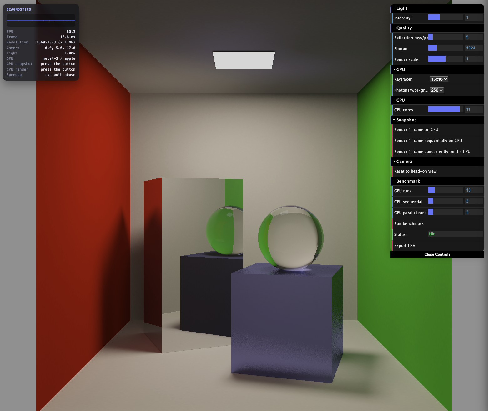
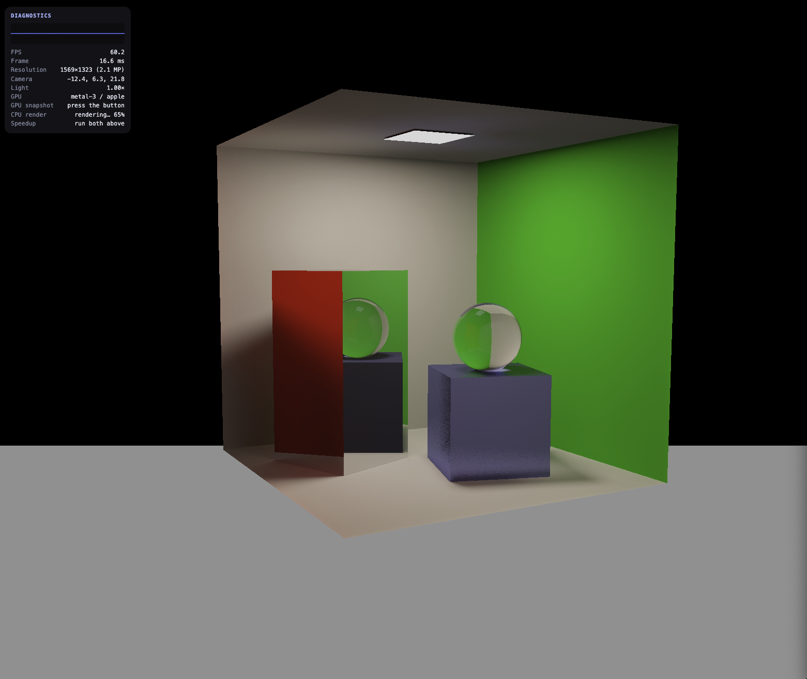

# Real-Time Ray Tracer (WebGPU)

A real-time ray tracer that renders a Cornell-box scene three different ways -
**sequential CPU**, **parallel CPU** (Web Workers), and **GPU** (WebGPU compute
shaders) - so the three can be benchmarked against each other on the same scene
and hardware.

The project was built to measure how much performance is gained by moving an
embarrassingly parallel workload (one independent ray per pixel) from a single
CPU thread, to many CPU threads, to the thousands of cores on a GPU. WebGPU was
chosen so the GPU path stays vendor-agnostic and runs on any modern machine
without platform-specific APIs.

**Authors:** Allen Clark, Vladyslav Huziienko, Mansoor Zafar

**Live demo:** [https://test-c6b77.web.app/](https://test-c6b77.web.app/)

**Original Assignment README:** [ASSIGNMENT-README.md](ASSIGNMENT-README.md)

---

## Demo

<p float="left">
  
  
</p>

**Video demo:**

https://github.com/user-attachments/assets/9c2d345e-1daa-4c14-aefd-c1843493396d

---

## Controls

Click the canvas first, then:

| Input                    | Action                             |
| ------------------------ | ---------------------------------- |
| `W` / `A` / `S` / `D`    | Move forward / left / back / right |
| `Space`                  | Move up                            |
| `Shift` / `Ctrl` / `C`   | Move down                          |
| Mouse drag (left button) | Look around                        |

The panel in the top-right (dat.GUI) exposes render settings (light intensity,
reflection rays, render scale, workgroup sizes, CPU core count), a **Snapshot**
folder to render a single frame on a chosen backend, and a **Benchmark** folder
to time and compare the backends.

---

## Getting started

**Prerequisites**

- **Node.js 18+**
- A **WebGPU-capable browser** — Chrome or Edge 113+ (desktop). Safari 18+ and
  recent Firefox also work. The app shows an error dialog if WebGPU is
  unavailable.

**Install and run (development)**

```bash
npm install
npm run dev
```

Vite prints a local URL (default http://localhost:5173) — open it in a WebGPU
browser.

**Production build / preview**

```bash
npm run build     # outputs to dist/
npm run preview   # serves the built dist/ locally
```

**Lint / format**

```bash
npm run lint      # prettier --check + eslint
npm run lint:fix  # auto-fix where possible
```

---

## Reproducing the benchmarks

1. Run the app (`npm run dev`) and open it in a WebGPU browser.
2. Adjust render settings if desired (e.g. `renderScale`, `reflectionRays`).
3. Open the **Benchmark** folder in the GUI, set the number of runs for each
   backend (GPU / CPU sequential / CPU parallel), and click **Run benchmark**.
4. Click **Export CSV** to download the per-run timings.

The raw measurements used in our report live in [`raw_data/`](raw_data/), one
spreadsheet per test machine (external GPU, Apple Silicone, and an
integrated Intel CPU).

---

## Project structure

```
src/
├── main.ts                 App entry point: sets up WebGPU, the GUI, the render
│                           loop, and wires the scene + renderers + benchmark.
│
├── core/                   Shared infrastructure
│   ├── common.ts           WGSL + the common uniform buffer / bind groups
│   │                       used by every compute pipeline; builds the camera
│   │                       projection and per-frame uniforms.
│   ├── diagnostics.ts      DOM stats panel: FPS, resolution, camera position,
│   │                       snapshot / CPU timings, and GPU-vs-CPU speedup.
│   ├── benchmark.ts        Benchmark GUI folder: runs N frames per backend,
│   │                       averages the times, and exports them as CSV.
│   ├── util.ts             WebGPU capability checks and user-facing error dialogs.
│   └── wgsl.d.ts           TypeScript declaration so `.wgsl` files import as strings.
│
├── scene/                  Scene + camera + input
│   ├── scene.ts            The Cornell-box scene as a list of flat quads (+ a
│   │                       glass sphere): geometry, materials, and the light panel.
│   ├── camera.ts           Camera interface and the WASD camera controls that
│   │                       produces the view matrix each frame.
│   └── input.ts            Keyboard / mouse / touch handler.
│
├── renderers/
│   ├── gpu/                GPU backend - WebGPU compute pipelines
│   │   ├── radiosity.ts    Drives the photon-tracing pass that bakes the lightmap.
│   │   ├── raytracer.ts    Drives the per-pixel reflection/ray-casting pass.
│   │   └── tonemapper.ts   Reinhard tonemap + gamma correction.
│   │
│   └── cpu/                CPU backend - a port of the GPU raytracer
│       ├── cpuRaytracer.ts            Main-thread controller for the CPU render.
│       ├── cpuRayTracerStrategies.ts  Sequential vs. Parallel strategies: the
│       │                              worker pool and the row-band split.
│       ├── cpuRaytracer.worker.ts     The actual CPU raytracer, run in a Web Worker.
│       └── cpuRaytracerShared.ts      Request/message types shared between the
│                                      main thread and the worker.
│
└── shaders/                WGSL shader source
    ├── common.wgsl         Shared structs (Quad, Sphere) and intersection
    │                       helpers included by the other shaders.
    ├── radiosity.wgsl      Photon tracing + accumulation-to-lightmap conversion.
    ├── raytracer.wgsl      Per-pixel ray casting, reflections, glass refraction;
    │                       samples the lightmap and writes the HDR framebuffer.
    └── tonemapper.wgsl     Reinhard tonemapping + gamma correction.
```
